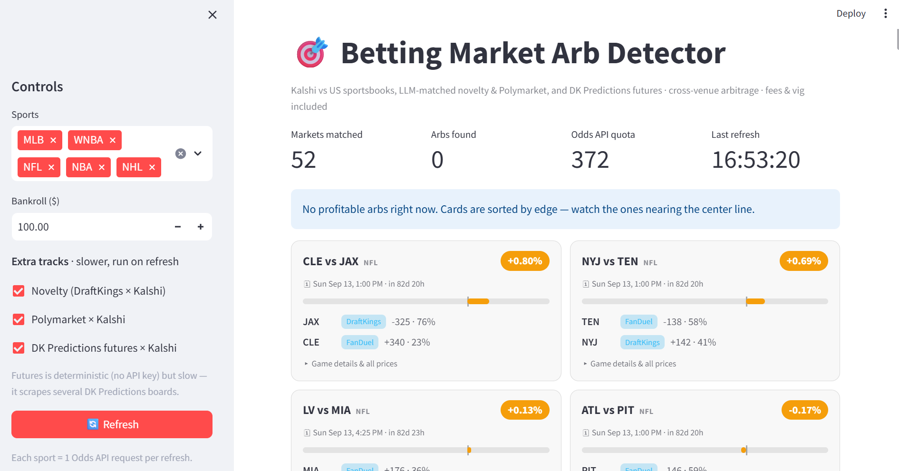
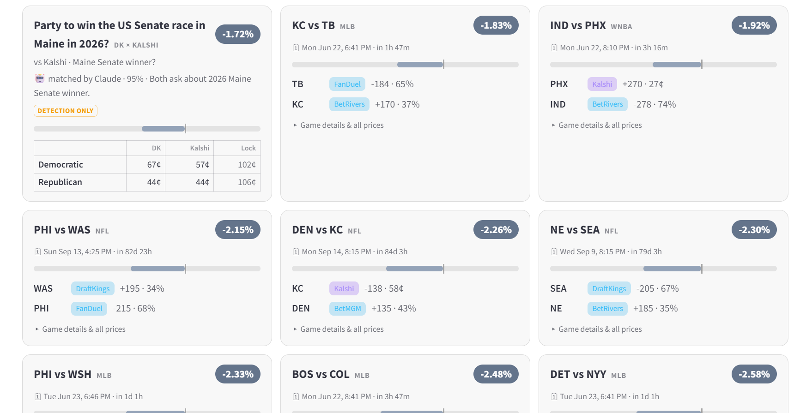

# prediction-market-arb

Finds risk-free arbitrage between Kalshi, DraftKings Predictions, Polymarket, and the major US sportsbooks. It prices the same outcome on two venues, fees included, and flags anything where the two sides add up to under $1.

I started this after catching a ~20% gap on the Nathan's Hot Dog Eating Contest between Kalshi and DraftKings. The real edge isn't in sports moneylines, those are efficient and the sharp money keeps them tight. It's in the low-volume prediction boards nobody bothers to police, like Time's Person of the Year, individual Senate races, or whether there's a recession, where DraftKings Predictions and Kalshi quietly disagree.

The main piece is the futures scanner: it pulls every board off DraftKings Predictions, finds the matching Kalshi market, and compares them candidate by candidate. The dashboard shows that next to the sports and Polymarket tracks in one grid, and a daily monitor pings me when an arb actually opens (they're intermittent, so a one-off scan usually shows nothing).



## What it does

- Scans DraftKings Predictions boards (culture, politics, economics, business) against their Kalshi counterparts, candidate by candidate
- Pulls live odds from Kalshi, ~10 US sportsbooks (via The Odds API), and Polymarket
- Prices everything with fees in: Kalshi's per-contract fee and the sportsbook vig
- Sizes each side in whole Kalshi contracts, so the stake it shows is what you actually enter
- Logs a daily history so you can watch a board drift toward an arb

## How the matching works

The hard part is knowing two boards are the same market. Three ways, depending on the board:

- Sports: exact team-registry match on the team set and game date. The date keeps a two-game series from collapsing into one fake match.
- Named futures like Person of the Year: match on shared candidate names. Real people on the board make overlap a reliable signal, and it's guarded so a small board sitting inside a big one can't sneak through (Person of the Decade is not Person of the Year).
- Binary and political boards like recession or a Senate race: the meaning is in the title, not the candidates, so Claude matches them and lines up the outcomes across venues (DK "Yes" to Kalshi "Starts", "Republicans" to the Republican candidate). It runs at high confidence and knows a different institution or place is never a match, so it won't pair the ECB with the Fed.



## Architecture

Separate tracks. Same fee and sizing math, matched differently, and they only meet as cards in the dashboard.

| Track | Venues | Matching |
|---|---|---|
| Sports | Kalshi x ~10 US sportsbooks | per-sport team registry (exact, free) |
| Futures | DraftKings Predictions x Kalshi | candidate-name overlap, plus Claude for binary/political boards |
| Polymarket | Polymarket x Kalshi | Claude (semantic) |

The sports path never loads the LLM or browser dependencies, those are imported lazily only when you turn on a track that needs them.

The futures track doesn't scrape live from the dashboard. The monitor does the scraping and writes a local cache; the dashboard reads that cache so it loads instantly, with an "Update DK data" button that reruns the scraper on demand. The older DraftKings sportsbook novelty scraper is still in the repo but isn't wired into the dashboard.

```
src/
├── models.py                  # Canonical types: Market, Outcome
├── timeutil.py                # ET game-date helpers (timezone alignment)
├── adapters/                  # data sources -> normalized Markets
│   ├── kalshi.py              #   Kalshi API (RSA-PSS auth)
│   ├── odds_api.py            #   The Odds API (best line across US books)
│   ├── dk_novelty.py          #   DraftKings sportsbook novelty scraper
│   ├── dk_predictions.py      #   DraftKings Predictions futures scraper
│   └── polymarket.py          #   Polymarket Gamma API
├── matching/
│   ├── normalize.py           #   per-sport team registry
│   ├── matcher.py             #   sports match by team-set + date
│   ├── futures_matcher.py     #   candidate-name overlap for futures boards
│   └── llm_matcher.py         #   semantic matching (Claude): novelty, Polymarket, futures
├── arb/
│   ├── fees.py                #   Kalshi fee / sportsbook vig models
│   ├── sizing.py              #   whole-contract bet sizing
│   ├── detector.py            #   sports arb detection
│   ├── novelty_detector.py    #   DraftKings sportsbook x Kalshi arb
│   ├── polymarket_detector.py #   Polymarket x Kalshi arb
│   └── futures_detector.py    #   per-candidate DK Predictions x Kalshi comparison
├── pipeline.py                # fetch -> match -> detect
└── dashboard/
    ├── app.py                 #   Streamlit UI (one edge-sorted grid)
    ├── cards.py               #   maps each track's result to a card
    └── cache.py               #   last-good scan, so a throttled scrape still shows data
scripts/
├── run_dk_predictions.py      # one-off futures scan vs Kalshi
└── monitor_futures.py         # daily scan + history log + arb alert
tests/                         # sports, novelty, and futures unit tests
```

## Setup

1. Install dependencies
```bash
pip install -r requirements.txt
```

2. Get API credentials
- Kalshi: sign up at [kalshi.com](https://kalshi.com), create an API key under Account > API, download the `.pem`, save it to `.secrets/kalshi.pem`
- The Odds API: sign up at [the-odds-api.com](https://the-odds-api.com) and copy your key
- Anthropic: get a key at [console.anthropic.com](https://console.anthropic.com). Needed for the futures, novelty, and Polymarket matching; the sports track runs without it.

3. Configure environment
```bash
cp .env.example .env   # then fill in your keys
```
```
KALSHI_KEY_ID=your_key_id
ODDS_API_KEY=your_key
KALSHI_KEY_FILE=.secrets/kalshi.pem
ANTHROPIC_API_KEY=sk-ant-...
```

4. Run
```bash
python config/settings.py            # prints [OK] when configured
streamlit run src/dashboard/app.py   # the dashboard
python scripts/run_dk_predictions.py # one-off futures scan vs Kalshi
```

## Daily monitor

The gaps are intermittent, so the useful mode is to scan once a day and only hear about it when there's something to act on.

```bash
python scripts/monitor_futures.py            # one scan; logs to data/, alerts on a real arb
python scripts/monitor_futures.py --loop 24  # or scan every 24h
```

Each run logs to `data/monitor_history.jsonl`. When a board crosses into arb territory it writes `data/arbs_found.log`, prints a banner, and pops a desktop alert. On Windows, run it daily with Task Scheduler.

## Tests

```bash
python -m tests.test_detector            # sports: matching, dates, arb math
python -m tests.test_novelty_detector    # cross-venue Dutch-book sizing
python -m tests.test_futures             # futures matcher gate + comparison math
```

## Scope

- Detection, not execution. The sportsbooks and DraftKings Predictions have no betting API, so you place those yourself; the tool gives you the edge and the exact stakes. Kalshi has a trading API, which is the path to auto-placing the Kalshi leg later.
- Top-of-book only, no order-book depth yet.
- Personal project, built and run for myself.
